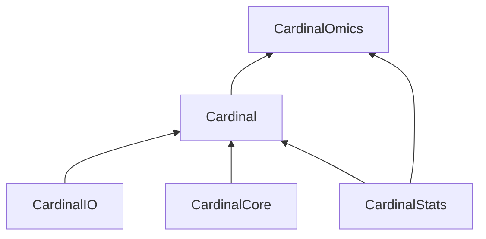

## Statistical software for spatial biology

*__Cardinalverse__* is a Github organization for software and research in spatial molecular biology led by Prof. Kylie Ariel Bemis in collaboration with Olga Vitek Lab at the Khoury College of Computer Sciences at Northeastern University.

The organization develops and maintains a collection of statistical software packages for spatial omics in the *__Cardinalverse__* ecosystem started by the *`Cardinal`* package. Originally released on Bioconductor in 2015 and winner of the 2015 John M. Chambers Statistical Software Award by the American Statistical Association (ASA), *`Cardinal`* provides analytical workflows for mass spectrometry imaging (MSI) experiments.

## R Packages

We are currently in the process of refactoring *`Cardinal`* into an ecosystem of related packages. The primary goal is a stronger and more intuitive separation of responsibilities and dependencies compared to the current monolithic approach where all pre-processing, visualization, and statistical learning methods live in the *`Cardinal`* package. A secondary goal is to reduce the dependency (and tight coupling) with the backend *`matter`* package (which is currently used for various processing and iteration tasks in addition to its original stated purpose of handling out-of-memory arrays).

The vision for the *__Cardinalverse__* ecosystem is visualized in the graph below:

#### Cardinal

`Cardinal` is the frontend for MSI-based workflows. It should be a pure R package for easy user installation from source (for providing release previews and hotfixes without requiring compilation).

It implements the classes most users will manipulate directly, including:

- `MSImagingArrays` : unaligned mass spectra with pixel metadata
- `MSImagingExperiment` : aligned mass spectra with pixel metadata and feature metadata
- `PositionDataFrame` : data frame with required position and run metadata
- `MassDataFrame` : data frame with required m/z metadata
- `SpectraArrays` : spectra array lists or matrices

It depends on `CardinalIO` for I/O, `CardinalCore` for spectral processing and visualization, and `CardinalStats` for statistical learning.

It should avoid dependencies on any packages other than those above and core Bioconductor infrastructure such as `S4Vectors`. It should avoid unnecessary dependencies on core Bioconductor infrastructure that is better handled by `CardinalOmics`.

#### CardinalIO

`CardinalIO` is responsible for reading and writing file formats directly supported by the *Cardinalverse* (i.e., those we implement and maintain ourselves rather than depend on third-party packages or utilities). This is primarily **imzML**. Support for most other formats (such as **HDF5**, **zarr**, **SpatialData**, etc.) should use third-party packages for support.

It includes compiled C/C++ code for efficiently parsing XML (via the vendored `pugixml` header-only C++ library).

It should avoid dependencies on any packages other than `matter`, `ontologyIndex`, and core Bioconductor infrastructure.

<!--

**Here are some ideas to get you started:**

🙋‍♀️ A short introduction - what is your organization all about?
🌈 Contribution guidelines - how can the community get involved?
👩‍💻 Useful resources - where can the community find your docs? Is there anything else the community should know?
🍿 Fun facts - what does your team eat for breakfast?
🧙 Remember, you can do mighty things with the power of [Markdown](https://docs.github.com/github/writing-on-github/getting-started-with-writing-and-formatting-on-github/basic-writing-and-formatting-syntax)
-->
